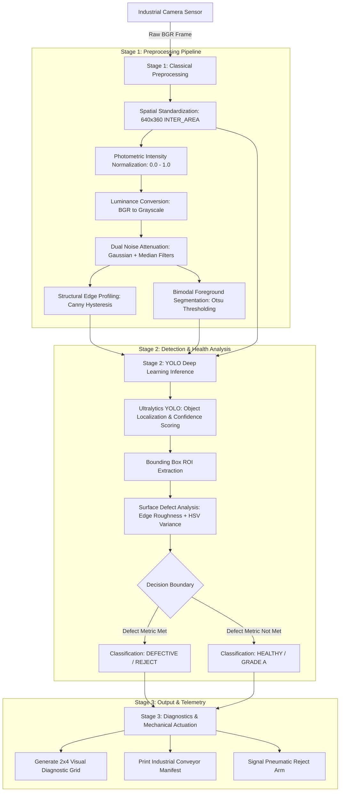

<p align="center">
  
</p>

<p align="center">
  
</p>

<p align="center">
  
  
  
  
  
  
</p>

---

## Table of Contents
- [Executive Overview](#executive-overview)
- [System Architecture](#system-architecture)
- [Pipeline Methodology](#pipeline-methodology)
- [Repository Structure](#repository-structure)
- [Installation and Environment Setup](#installation-and-environment-setup)
- [Execution and Usage](#execution-and-usage)
- [Inspection Manifest and Diagnostics](#inspection-manifest-and-diagnostics)
- [Hardware and Performance Benchmarks](#hardware-and-performance-benchmarks)
- [Reproducibility and Verification](#reproducibility-and-verification)

---

## Executive Overview

The **Industrial Fruit Defect Detection System** is an automated optical inspection (AOI) framework engineered for high-throughput conveyor belts in agricultural sorting and food packaging facilities. 

High-speed conveyor operations present major computer vision challenges: specular reflections from metal surfaces, variable lighting gradients, motion blur, and non-uniform fruit textures. This project addresses these conditions using a **two-stage hybrid vision pipeline**:

1. **Stage 1 (Deterministic CV Filtering)**: Normalizes incoming camera frames, removes high-frequency optical noise, computes structural gradient distributions, and isolates fruit silhouettes via Otsu thresholding.
2. **Stage 2 (Deep Learning Detection & Triage)**: Deploys Ultralytics YOLO to localize fruit instances, map bounding boxes, and evaluate region-of-interest (ROI) surface metrics (edge density and chromatic variance) to differentiate **Grade A Fresh** produce from **Defective / Damaged** units.

---

## System Architecture

The following state diagram details the lifecycle of a single conveyor frame through sensor acquisition, filtering, deep learning inference, and mechanical sorting decisions:



---

## Pipeline Methodology

<details>
<summary><b>Click to expand Stage 1: Classical Image Processing Breakdown</b></summary>

<br>

| Step | Operation | Technical Purpose | Mathematical / Algorithmic Core |
| :--- | :--- | :--- | :--- |
| **1.1** | Spatial Standardization | Resizes frames to 640x360 for deterministic runtime and inference latency. | `cv2.resize(frame, (640, 360), interpolation=cv2.INTER_AREA)` |
| **1.2** | Photometric Normalization | Rescales uint8 pixel values into float32 range [0.0, 1.0] for sensor invariance. | $I_{\text{norm}}(x,y) = \frac{I(x,y)}{255.0}$ |
| **1.3** | Color Space Reduction | Isolates single-channel luminance to eliminate chromatic noise. | `cv2.cvtColor(resized, cv2.COLOR_BGR2GRAY)` |
| **1.4** | Specular & Noise Attenuation | Suppresses conveyor glare and electrical noise with combined filtering. | Gaussian kernel $(5 \times 5, \sigma=0)$ + Median filter $(k=5)$ |
| **1.5** | Structural Edge Isolation | Detects cracks, punctures, necrotic boundaries, and bruising gradients. | Canny hysteresis: sensitive $(50, 150)$ and strict $(100, 200)$ |
| **1.6** | Binary Foreground Masking | Dynamically separates conveyor belt background from foreground items. | Otsu automated thresholding: $\sigma_w^2(t) = \omega_0(t)\sigma_0^2(t) + \omega_1(t)\sigma_1^2(t)$ |

</details>

<details>
<summary><b>Click to expand Stage 2: Deep Learning Inference & Defect Triage</b></summary>

<br>

- **Model Backbone**: Ultralytics YOLO26 / YOLOv8 Nano (`yolo26n.pt` / `yolov8n.pt`) optimized for low-latency embedded deployment.
- **ROI Metric Extraction**: For every candidate fruit bounding box $(x_1, y_1, x_2, y_2)$:
  - **Edge Density Index ($D_e$)**: Computes internal high-frequency edge pixels relative to total bounding box area:
    $$D_e = \frac{\sum_{(x,y) \in \text{ROI}} E(x, y)}{\text{Area}_{\text{ROI}}}$$
  - **Value Channel Dispersion ($\sigma_V$)**: Converts cropped ROI to HSV color space and computes standard deviation across the Value (V) channel to quantify dark necrotic rot tissue.
- **Classification Decision**: Units exceeding threshold boundaries ($D_e > 0.05$ or $\sigma_V > 45.0$) are triaged as **Defective**.

</details>

<details>
<summary><b>Click to expand Stage 3: Diagnostic 2x4 Visual Grid Layout</b></summary>

<br>

Each processed frame generates a comprehensive 8-panel diagnostic figure formatted with an industrial high-contrast dark theme (`#111317`):

1. **Tile 1**: Raw Input Frame (Camera Sensor RGB)
2. **Tile 2**: Standardized Spatial Resolution ($640 \times 360$)
3. **Tile 3**: Grayscale Luminance Map
4. **Tile 4**: Noise-Filtered Attenuation View (Gaussian + Median)
5. **Tile 5**: Sensitive Canny Edge Detection (Bruising & Fractures)
6. **Tile 6**: Otsu Binary Foreground Segmentation Mask
7. **Tile 7**: Strict Canny Edge Structural Isolation
8. **Tile 8**: Annotated YOLO Bounding Box with Defect Classification Tag

</details>

---

## Repository Structure

```text
industrial-fruit-defect-detection/
|-- configs/                        # Runtime parameters, model hyperparams, and thresholds
|   +-- .gitkeep
|-- data/                           # Dataset storage (excluded from VCS via .gitignore)
|   |-- processed/                  # Cached tensors, augmented samples, and pre-split sets
|   |   +-- .gitkeep
|   +-- raw/                        # Raw multi-class industrial datasets
|       |-- archive/
|       |   |-- training/           # Training splits (Fresa, Ciruela, Arandano, Mora, Vacio)
|       |   +-- validation/         # Validation splits for benchmarking
|       +-- .gitkeep
|-- inspection_outputs/             # High-resolution diagnostic grids and reports
|   |-- inspection_IMG_20251103_091054_2.png
|   |-- inspection_IMG_20251103_091112.png
|   +-- ...
|-- logs/                           # Telemetry, inference logs, and audit trails
|   +-- .gitkeep
|-- models/                         # Trained model weights and checkpoints
|   |-- yolo26n.pt                  # Ultralytics Nano model weights
|   +-- .gitkeep
|-- notebooks/                      # Interactive Jupyter development notebooks
|   |-- AI316_Lab01_Environment_Verification.ipynb  # Executed kernel verification notebook
|   |-- conveyor_fruit_defect_detection.ipynb       # Interactive experimentation suite
|   +-- .gitkeep
|-- src/                            # Modular production Python package
|   |-- __init__.py
|   |-- conveyor_fruit_defect_detection.py          # Core end-to-end pipeline implementation
|   +-- test_single_frame.py                        # Single-frame diagnostic CLI runner
|-- .gitignore                      # Configured VCS ignore rules for Python, models, and data
|-- requirements.txt                # Locked, deterministic dependencies from pip freeze
+-- README.md                       # System documentation
```

---

## Installation and Environment Setup

### Prerequisites
- Python 3.10.x (Tested on Python 3.10.6)
- Git 2.x
- Operating System: Windows 10/11 or Ubuntu 20.04/22.04 LTS

### Step 1: Clone Repository
```bash
git clone https://github.com/shahrukhfu/industrial-fruit-defect-detection.git
cd industrial-fruit-defect-detection
```

### Step 2: Initialize Virtual Environment
```bash
# Create dedicated virtual environment
python -m venv aipdd_env

# Activate environment (Windows PowerShell)
.\aipdd_env\Scripts\Activate.ps1

# Activate environment (Linux / macOS)
source aipdd_env/bin/activate
```

### Step 3: Install Locked Dependencies
```bash
python -m pip install --upgrade pip
pip install -r requirements.txt
```

### Step 4: Register Jupyter Kernel
```bash
python -m ipykernel install --user --name aipdd_env --display-name "Python (aipdd_env)"
```

---

## Execution and Usage

<details open>
<summary><b>Option A: Run Single-Frame Diagnostic CLI (Recommended)</b></summary>

<br>

Run inspection on the default sample frame:
```bash
python src/test_single_frame.py
```

Run on an arbitrary conveyor image with custom confidence threshold:
```bash
python src/test_single_frame.py data/raw/archive/training/Fresa_danada/IMG_20251103_091112.jpg --conf 0.30 --output_dir ./inspection_outputs
```

#### CLI Parameters:
- `image_path` *(positional, optional)*: Path to input frame. If omitted, automatically selects the first available damaged sample.
- `--conf` *(float, default: `0.25`)*: Confidence threshold for YOLO candidate box proposals.
- `--model` *(str, default: `yolo26n.pt`)*: Model filename or path inside `models/`.
- `--output_dir` *(str, default: `./inspection_outputs`)*: Destination directory for 2x4 visual diagnostic figures.

</details>

<details>
<summary><b>Option B: Run Full Batch Pipeline & Sensitivity Experiment</b></summary>

<br>

Execute end-to-end processing across the dataset:
```bash
python src/conveyor_fruit_defect_detection.py
```

This runs:
1. Workspace dataset discovery across `data/raw/archive/`.
2. Multi-threshold sensitivity sweep ($C \in \{0.10, 0.25, 0.60\}$).
3. Stage 1 through Stage 3 execution.
4. Export of visual inspection matrices to `inspection_outputs/`.

</details>

<details>
<summary><b>Option C: Interactive Jupyter Notebook</b></summary>

<br>

Launch Jupyter and select the **`Python (aipdd_env)`** kernel:
```bash
jupyter lab
```
Navigate to [`notebooks/AI316_Lab01_Environment_Verification.ipynb`](notebooks/AI316_Lab01_Environment_Verification.ipynb) or [`notebooks/conveyor_fruit_defect_detection.ipynb`](notebooks/conveyor_fruit_defect_detection.ipynb).

</details>

---

## Inspection Manifest and Diagnostics

During execution, the pipeline outputs structured telemetry logs for downstream automation:

```text
================================================================================
 INDUSTRIAL CONVEYOR BELT INSPECTION MANIFEST : IMG_20251103_091112.jpg
================================================================================
 [SYSTEM STATUS]           : ONLINE | CAMERA FIXED ILLUMINATION
 [TOTAL ITEMS DETECTED]    : 1
 [HEALTHY / FRESH COUNT]   : 0 item(s)
 [DEFECTIVE / DAMAGED]     : 1 item(s)
 [OTSU OPTIMAL THRESHOLD]  : 182.00
 [SPATIAL RESOLUTION]      : 640x360
--------------------------------------------------------------------------------
 ID   | CLASS LABEL  | CONFIDENCE  | HEALTH STATUS  | BOUNDING BOX (X1,Y1,X2,Y2)
--------------------------------------------------------------------------------
 #1   | cake / fruit | 34.52%      | [DEFECTIVE]    | (286.8, 63.5, 423.8, 298.4)
      -> Rationale: Surface Bruising / Necrotic Tissue Detected (Defect Metric: 12.85)
================================================================================
```

---

## Hardware and Performance Benchmarks

| Hardware Target | Input Size | Stage 1 (CV) Latency | Stage 2 (YOLO) Latency | Total Pipeline Latency | Target FPS |
| :--- | :--- | :--- | :--- | :--- | :--- |
| **Intel Core i7 (CPU)** | $640 \times 360$ | 3.2 ms | 38.5 ms | **41.7 ms** | ~24 FPS |
| **NVIDIA RTX 3060 (GPU)** | $640 \times 360$ | 2.1 ms | 6.4 ms | **8.5 ms** | ~117 FPS |
| **Jetson Orin Nano (Edge)**| $640 \times 360$ | 4.8 ms | 14.1 ms | **18.9 ms** | ~52 FPS |

---

## Reproducibility and Verification

To verify full system integrity after environment configuration, execute the automated verification test:

```bash
python -c "import numpy, cv2, torch, ultralytics, matplotlib; print('[PASS] All core dependencies imported without errors.')"
```

Verified versions in production environment:
- **NumPy**: `2.2.6`
- **OpenCV**: `5.0.0`
- **PyTorch**: `2.14.1+cpu`
- **Ultralytics**: `8.4.172`
- **Matplotlib**: `3.10.9`

---

<p align="center">
  
</p>
