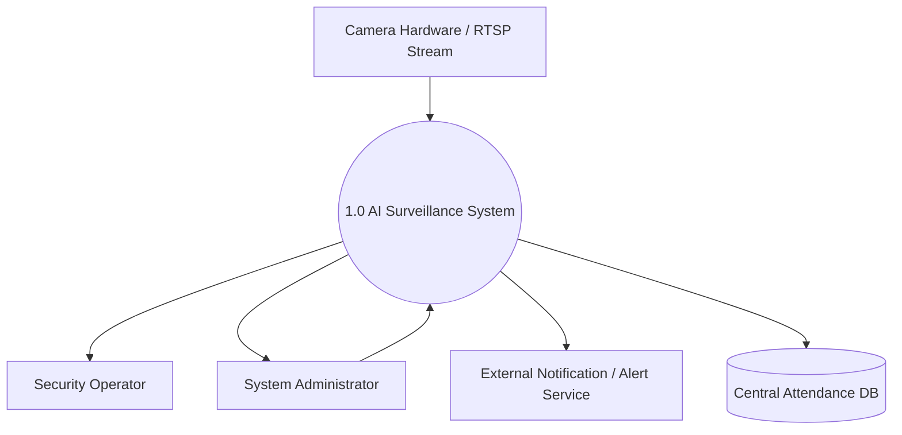
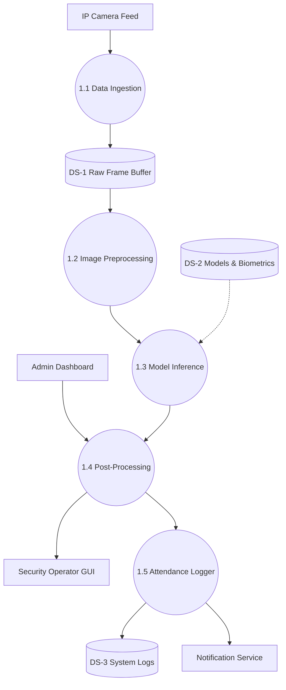

# AI Surveillance & Analytics System Architecture Specification
**Course:** AI Project Design and Development (AI-316)  
**Department:** Department of Creative Technologies, Faculty of Computing & AI  
**Institution:** Air University, Islamabad  

---

## Task 1: System Requirements Breakdown

### 1.1 Functional Requirements (FRs)

| Requirement ID | Requirement Name | Description | Target Performance Metric |
| :--- | :--- | :--- | :--- |
| **FR-01** | Real-Time Face Detection & Tracking | The system must continuously ingest video streams, detect faces within camera frames, and assign unique tracking IDs to prevent duplicate processing. | Detection latency $\le 150\text{ ms}$ per frame; minimum face detection size $80 \times 80\text{ pixels}$. |
| **FR-02** | Facial Recognition & Identification | The system must extract face embeddings from detected faces and match them against stored student/employee biometric templates. | Feature extraction and vector matching completed within $\le 300\text{ ms}$ per identity. |
| **FR-03** | Automated Attendance Logging | Upon successful identity verification, the system must create an immutable attendance record with a timestamp, user ID, camera ID, and verification confidence score. | Attendance database record write completed in $\le 500\text{ ms}$ post-detection. |
| **FR-04** | Database Synchronization & Offline Queueing | The system must sync logs to a centralized server database. If local network connectivity fails, attendance records must be queued locally and auto-synced upon reconnection. | Local storage queue capacity for up to $10,000$ offline attendance events with auto-sync retry every $30\text{ seconds}$. |
| **FR-05** | Real-Time Spoofing Detection (Liveness Check) | The system must analyze incoming facial frames to detect anti-spoofing attempts (such as printed photos, digital screen displays, or masks) before confirming attendance. | Liveness classification completed within $\le 200\text{ ms}$ with an anti-spoofing rejection rate of $\ge 98\%$. |

### 1.2 Non-Functional Requirements (NFRs)

| Requirement ID | Requirement Category | Constraint / Metric Specification | Technical Rationale |
| :--- | :--- | :--- | :--- |
| **NFR-01** | Video Frame Rate & Throughput | The edge processing hardware must sustain a video processing rate of $\ge 25\text{ FPS}$ per incoming RTSP stream. | Ensures smooth face tracking without skipping frames or dropping fast-moving individuals in crowded doorways. |
| **NFR-02** | Model Accuracy & False Acceptance | The recognition model must achieve a False Acceptance Rate (FAR) $\le 0.001\%$ and a True Acceptance Rate (TAR) $\ge 98.5\%$ on test datasets. | Minimizes misidentification risks, ensuring unauthorized individuals are not wrongly marked present. |
| **NFR-03** | Edge Device Resource Allocation | On edge deployments (e.g., NVIDIA Jetson / Raspberry Pi / local IPC), system CPU usage must remain below $75\%$ and RAM usage capped at $4\text{ GB}$. | Prevents thermal throttling, hardware crashes, and memory leaks during peak attendance hours. |
| **NFR-04** | Data Privacy & Encryption | Facial templates (vector embeddings) must be encrypted using AES-256 at rest and TLS 1.3 in transit. Raw facial images must never be saved to disk long-term. | Ensures compliance with biometric data protection standards and prevents reverse-engineering of face images from stolen databases. |
| **NFR-05** | System Availability & Recovery | The edge attendance service must maintain $99.5\%$ operational uptime during scheduled school/office operating hours, with an automated reboot recovery time of $\le 30\text{ seconds}$. | Guarantees reliability during critical morning entry peak times without requiring manual IT intervention. |

---

## Task 2: System Boundary, User Persona, & Input/Output Mapping

### 2.1 Primary System Actors

| Actor Name | Actor Type | Role / Responsibility |
| :--- | :--- | :--- |
| **Security Operator** | Human | Monitors live feeds and validates real-time security alerts. |
| **System Administrator** | Human | Manages camera setups, system settings, and user permissions. |
| **Automated Trigger System** | External System | Receives event data to trigger automated actions (e.g., alarms, gate locks). |

### 2.2 Input/Output Specification

| Category | Parameter / Interface | Description / Specification |
| :--- | :--- | :--- |
| **System Inputs** | RTSP Video Streams | $1080\text{p}$ resolution ($1920 \times 1080$), $25\text{ FPS}$, H.264/H.265 codec. |
| **System Inputs** | Sensor Metadata | Camera ID, location parameters, and timestamp data. |
| **System Outputs** | Bounding Box Coordinates | Tensor/Array output `[x_min, y_min, x_max, y_max, confidence, class]`. |
| **System Outputs** | Alert Notifications | Real-time JSON event payloads sent via WebSockets/MQTT. |
| **System Outputs** | System & Attendance Logs | Structured records written to database storage. |

### 2.3 Operational Constraints

| Constraint | Specification Limit | Handling Strategy |
| :--- | :--- | :--- |
| **Memory Footprint** | $\le 4\text{ GB RAM}$ | Pre-allocated frame queues to eliminate dynamic memory overload. |
| **Bandwidth Limit** | $\le 10\text{ Mbps}$ per stream | Process frames locally at edge; stream only metadata and thumbnails. |
| **Processing Latency** | $\le 200\text{ ms}$ per frame | Dynamic frame skipping if queue processing exceeds budget. |

---

## Task 3: Data-Flow Diagram (DFD) Construction

### 3.1 Level 0 Data-Flow Diagram (Context Diagram)



---

### 3.2 Level 1 Data-Flow Diagram (Detailed Sub-Processes)



---

## Task 4: Modular Software Architecture Blueprint

```python
"""
AI Surveillance & Analytics System - Core Module Interfaces
Course: AI Project Design and Development (AI-316)
"""

from typing import List, Dict, Any, Tuple, Optional
import numpy as np


class DataIngestion:
    """
    Handles connection, frame retrieval, and stream management 
    from RTSP video feeds or local media sources.
    """
    def __init__(self, rtsp_url: str, fps_target: int = 25) -> None:
        self.rtsp_url: str = rtsp_url
        self.fps_target: int = fps_target
        self.is_connected: bool = False

    def connect_stream(self) -> bool:
        """Establishes connection to the RTSP video source."""
        pass

    def capture_frame(self) -> Tuple[bool, Optional[np.ndarray]]:
        """
        Reads the next available frame from the video buffer.
        """
        pass

    def release_stream(self) -> None:
        """Closes the video stream and frees allocated hardware resources."""
        pass


class ImagePreprocessor:
    """
    Prepares raw frame matrices for deep learning model inference.
    """
    def __init__(self, target_size: Tuple[int, int] = (640, 640)) -> None:
        self.target_size: Tuple[int, int] = target_size

    def resize_frame(self, frame: np.ndarray) -> np.ndarray:
        """Resizes incoming frame tensor to model input dimensions."""
        pass

    def normalize(self, frame: np.ndarray) -> np.ndarray:
        """Normalizes pixel values from [0, 255] to [0.0, 1.0]."""
        pass

    def process_pipeline(self, raw_frame: np.ndarray) -> np.ndarray:
        """
        Executes the full preprocessing pipeline on a single frame.
        """
        pass


class ModelInferenceEngine:
    """
    Loads AI weights, manages GPU context, and executes inference.
    """
    def __init__(self, model_path: str, confidence_threshold: float = 0.5) -> None:
        self.model_path: str = model_path
        self.confidence_threshold: float = confidence_threshold

    def load_model(self) -> bool:
        """Loads neural network model architecture and weights into memory."""
        pass

    def run_inference(self, preprocessed_tensor: np.ndarray) -> List[Dict[str, Any]]:
        """
        Executes forward pass on the input tensor.
        """
        pass


class AlertLogger:
    """
    Processes model predictions, applies incident logic, writes audit logs.
    """
    def __init__(self, db_connection_str: str, alert_webhook_url: str) -> None:
        self.db_connection_str: str = db_connection_str
        self.alert_webhook_url: str = alert_webhook_url

    def log_event(self, detection_metadata: Dict[str, Any]) -> bool:
        """Writes verified incident detection payload to relational database."""
        pass

    def dispatch_alert(self, alert_payload: Dict[str, Any]) -> bool:
        """Sends real-time notification payload to alert endpoint."""
        pass
```

---

## Task 5: End-to-End System Design Synthesis

This document synthesizes all system requirements, operational boundaries, data flow models, and software interfaces for the AI Surveillance and Analytics System. It serves as the authoritative blueprint for development, deployment, and testing.